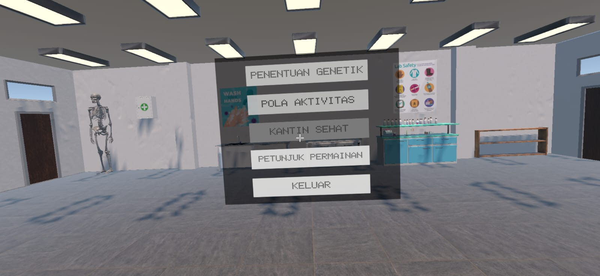
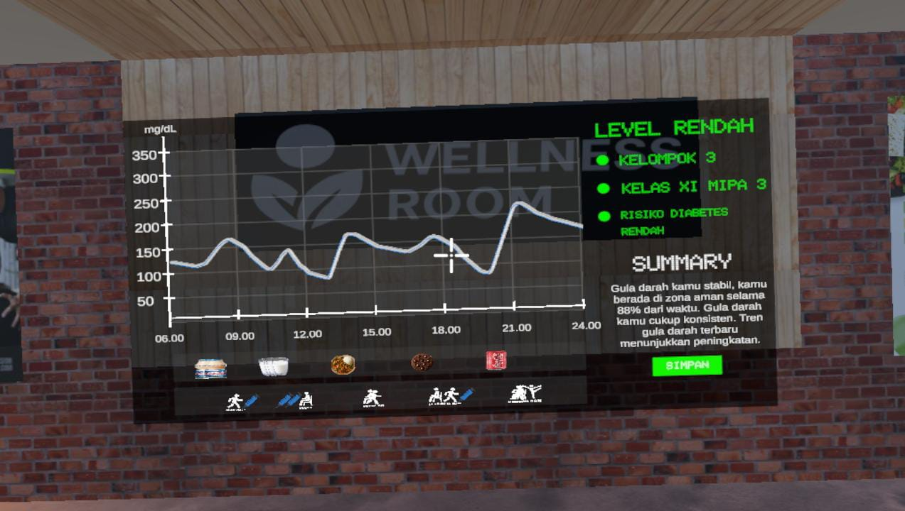
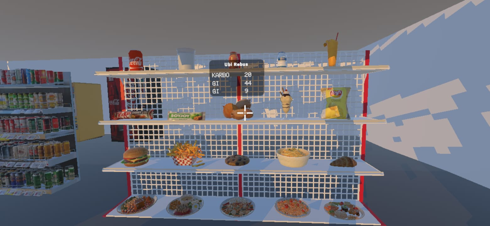

# VR HiOH Diabetes

> A mobile VR simulation game for thesis research on blood glucose dynamics in the human body.

---

## Table of Contents

- [Overview](#overview)
- [Research Context](#research-context)
- [Features](#features)
- [Tech Stack](#tech-stack)
- [Prerequisites](#prerequisites)
- [Getting Started](#getting-started)
- [Project Structure](#project-structure)
- [Scenes & Game Flow](#scenes--game-flow)
- [API Integrations](#api-integrations)
- [Configuration](#configuration)
- [Screenshots](#screenshots)
- [Known Limitations](#known-limitations)
- [License](#license)
- [Acknowledgements](#acknowledgements)

---

## Overview

VR HiOH Diabetes is a Virtual Reality simulation game built with Unity, targeting Android mobile devices. The application allows players to perform various daily activities — such as eating and exercising — while observing real-time changes in blood glucose levels within a simulated body model. It was developed as a research tool to support a thesis on glucose regulation and diabetes risk factors.

---

## Research Context

This project was developed to support thesis research on:

- **Topic:** Diabetes
- **Focus:** Blood glucose and sugar regulation in the human body
- **Researcher:** Adha Nisfatulsanah
- **Institution:** Sebelas Maret University / Faculty of Education and Teacher Training / Department Biology Education
- **Year:** 2026

The simulation incorporates genetic predisposition factors, dietary input, and physical activity to model dynamic glucose responses, giving researchers and participants an interactive, embodied way to understand diabetes mechanisms.

---

## Features

- VR-based first-person simulation playable on Android mobile devices
- Real-time blood glucose level tracking and visualization
- Food logging with nutritional data integration
- Physical activity simulation affecting glucose response
- Genetic profile configuration influencing diabetes risk
- Insulin injection simulation
- Historical glucose graph visualization
- User profile and identity management
- Session summary and result reporting

---

## Tech Stack

| Layer | Technology |
|---|---|
| Engine | Unity 6000.0.39f1 |
| Render Pipeline | Universal Render Pipeline (URP) 17.0.3 |
| Language | C# |
| Input | Unity Input System 1.13.0 |
| UI | Unity UGUI + TextMesh Pro |
| Serialization | Newtonsoft JSON 3.2.1 |
| Performance | Adaptive Performance (Samsung Android) 5.0.0 |
| Target Platform | Android (non-iPhone mobile) |

---

## Prerequisites

- Unity 6000.0.39f1 with Android Build Support module installed
- Android SDK & NDK (bundled with Unity or installed separately)
- [Spoonacular API key](https://spoonacular.com/food-api) for nutrition data

---

## Getting Started

### 1. Clone the repository

```bash
git clone https://github.com/[your-username]/VR-Adha.git
cd VR-Adha
```

### 2. Open in Unity

Open the project folder in Unity Hub. Make sure you are using Unity version **6000.0.39f1** to avoid compatibility issues.

### 3. Configure API keys

Copy the secrets template and fill in your credentials:

```
Secrets/
  ApiKeyConfig.cs   <-- fill in your API keys here
```

See [Configuration](#configuration) for details.

### 4. Set the build target

Go to **File > Build Settings**, select **Android**, and click **Switch Platform**.

### 5. Build and deploy

Connect your Android device, then click **Build and Run**, or build an APK via **File > Build Settings > Build**.

---

## Project Structure

```
Assets/
  Scenes/           # All Unity scenes
  Scripts/          # All C# game scripts
  3D Assets/        # 3D models and environments
  Activity Image/   # Activity-related UI images
  audio/            # Background music and sound effects
  food-img/         # Food item images
  Image-Icon/       # UI icons
  Textures/         # General textures and materials
  Resources/        # Runtime-loaded assets
  Settings/         # Unity project settings and render pipeline configs
  TextMesh Pro/     # TMP font and shader assets
Packages/           # Unity package dependencies
ProjectSettings/    # Unity project configuration
Secrets/            # API keys (not committed to version control)
```

---

## Scenes & Game Flow

| Scene | Description |
|---|---|
| `Homepage` | Application entry point and login screen |
| `Panel Mulai` | Start panel; directs the user to begin the simulation |
| `Generate Genetik` | Generates the player's genetic profile |
| `Pemilihan Genetik` | Player selects genetic factors influencing diabetes risk |
| `Main Game` | Core VR simulation — activities, glucose tracking, and interactions |
| `Show Result` | Displays the session summary and final glucose report |
| `Kantin Sehat` | Healthy canteen environment for food selection and logging |

**Typical flow:**

```
Homepage -> Panel Mulai -> Generate Genetik -> Pemilihan Genetik -> Main Game -> Show Result -> Kantin Sehat
```

---

## API Integrations

### Spoonacular Food API

Used to retrieve nutritional information for food items selected in the canteen scene.

- **Endpoint:** [https://api.spoonacular.com](https://api.spoonacular.com)
- **Used in:** `SpoonacularServices.cs`, `GetNutrition.cs`
- **Key required:** Yes — see [Configuration](#configuration)

### Python Anywhere

Used to create backend services that allows integration between app and Google Form.

- **Endpoint:** [https://dimaszudafa.pythonanywhere.com/upload](https://dimaszudafa.pythonanywhere.com/upload)
- **Used in:** `GoogleFormSender.cs`
- **Key required:** No

---

## Configuration

API keys and sensitive configuration should be placed in the `Secrets/` directory, which is excluded from version control.

```csharp
// Secrets/ApiKeyConfig.cs
public static class ApiKeyConfig
{
    public const string SpoonacularApiKey = "YOUR_API_KEY_HERE";
    // Add other keys as needed
}
```

> Do not commit this file. Make sure `Secrets/` is listed in `.gitignore`.

---

## Screenshots

> [Add screenshots or screen recordings here]

| Gameplay | Glucose Graph | Food Selection |
|---|---|---|
|  |  |  |

---

## Known Limitations

- Not compatible with iOS / iPhone devices
- Requires a physical Android VR headset for the intended experience; limited functionality on non-VR devices
- [Add any other known bugs or constraints]

---

## License

Virtual Reality Health in Our Hands Diabetes © 2025 by Adha Nisfatulsanah.
Licensed under Creative Commons Attribution-NonCommercial-NoDerivatives 4.0 International (CC BY-NC-ND 4.0).

To view a copy of this license, visit:
https://creativecommons.org/licenses/by-nc-nd/4.0/

To view a detail license and third-party credits, you can check License.txt in this repository.

For questions or further information, please contact:
adhanisfatulsanah01@student.uns.ac.id

---

## Acknowledgements

- **Researcher:** Adha Nisfatulsanah — for the research concept and domain guidance
- **Developer:** Dimas Zuda Fathul Akhir
